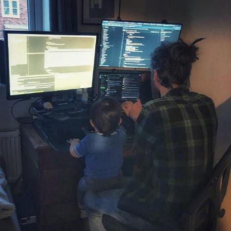

Welcome to **{{ site.title }}**, where I share my experiences as a self-taught software engineer! Here, you’ll find valuable insights and lessons from my hands-on adventures in striving for efficient and readable Python code, crafting Bash scripts, tinkering with React, experimenting with Rust, and exploring AI. Join me as I tackle the ups and downs of coding, offering real stories from my time in the trenches. Whether you’re a fellow coder, a curious tech enthusiast, or just looking for some inspiration, I hope my experiences spark your own explorations in the digital world!

