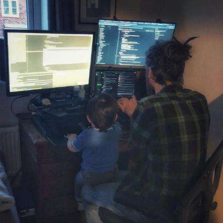

I used to think software engineering was purely about the code.

I spent years obsessing over syntactic minutiae: perfecting Python classes, wrestling with React state, and fiddling with bash loops. Don’t get me wrong—I still love writing code, and I still tackle LeetCode and Advent of Code puzzles for fun just to keep my eye in and stay sharp.

But over the past couple of years, the centre of gravity shifted completely.

Today, my obsession is with **systems, developer tooling, and agentic workflows**. 

We’re living through a fundamental transition in how software gets built. When you pair screaming-fast frontier models with local GPUs, deterministic task runners, and intelligent OS environments, the bottleneck is no longer how quickly you can type boilerplate. The real bottleneck is developer ergonomics: how your tools talk to each other, how agents discover deterministic capabilities, and how you eliminate the friction of acting as a biological copy-paste relay between terminal windows.

This blog—**{{ site.title }}**—is my notebook from those trenches. It’s where I document what happens when you treat AI coding agents as real engineering collaborators, build local-first tooling in Rust, and turn your desktop into an ambient, self-improving workspace.

Zero corporate posturing. No marketing fluff. Just practical systems engineering, sharp tools, and the lessons learnt from breaking things and putting them back together.

